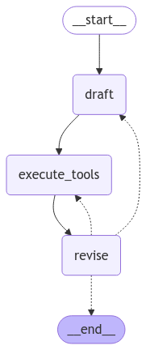

# Advanced Reflexion Agent

Un agent de réflexion avancé construit avec LangGraph qui utilise une approche réflexive pour améliorer ses réponses à des questions complexes.



## À propos du projet

Ce projet implémente un agent de réflexion avancé utilisant le framework LangGraph. L'agent est capable de:
- Fournir une première réponse détaillée à une question
- Réfléchir et critiquer sa propre réponse pour identifier ce qui manque ou ce qui est superflu
- Générer des requêtes de recherche pour obtenir des informations supplémentaires
- Réviser sa réponse en utilisant les nouvelles informations, incluant des citations numériques

L'architecture de l'agent suit un flux de travail itératif où chaque étape améliore la qualité de la réponse finale.

## Prérequis

- Python 3.9+
- [Poetry](https://python-poetry.org/docs/#installation) (gestionnaire de dépendances Python)
- Clés API pour:
  - OpenAI
  - Tavily (pour les recherches web)
  - LangSmith (optionnel, pour le traçage)

## Installation

1. Clonez ce dépôt
   ```bash
   git clone https://github.com/votre-username/advanced-reflexion-agent.git
   cd advanced-reflexion-agent
   ```

2. Installez les dépendances avec Poetry
   ```bash
   poetry install
   ```

3. Configurez vos variables d'environnement en copiant le fichier d'exemple
   ```bash
   cp .env.example .env
   ```
   
   Puis modifiez le fichier `.env` avec vos propres clés API.

## Utilisation

1. Activez l'environnement virtuel
   ```bash
   poetry shell
   ```

2. Exécutez l'agent avec une question
   ```bash
   python main.py
   ```
   
   Vous pouvez également modifier la question dans le fichier `main.py` pour tester différentes requêtes.

## Structure du projet

- `main.py` - Point d'entrée du projet, définit le graphe de l'agent
- `chains.py` - Contient les chaînes LangChain pour la génération de réponses
- `schemas.py` - Définit les schémas Pydantic utilisés pour structurer les sorties
- `tool_executor.py` - Implémente les outils de recherche pour l'agent

## Fonctionnement

L'agent fonctionne en suivant ces étapes:
1. Génère une première réponse à la question de l'utilisateur
2. Effectue une auto-critique de cette réponse
3. Génère des requêtes de recherche basées sur la critique
4. Exécute les recherches via l'API Tavily
5. Révise la réponse en incorporant les résultats des recherches
6. Répète le processus jusqu'à atteindre le nombre maximum d'itérations ou une réponse satisfaisante
